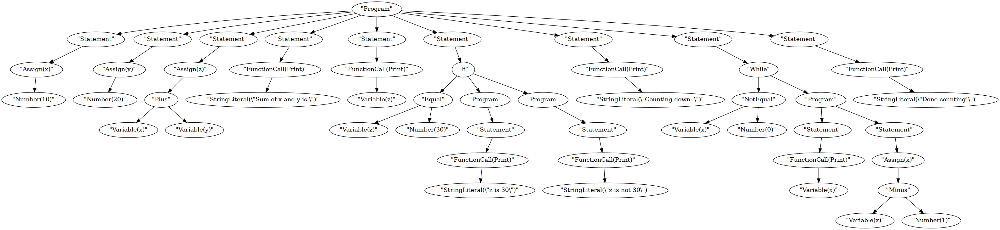

# AST Tree Example


## Abstract Syntax Tree (AST)
Here is an example of how the AST might look for a sample program:



## Code
Here is the code for the example above:

```rust
let x = 10;
let y = 20;
let z = x + y;
print("Sum of x and y is:");
print(z);

if z == 30
{
    print("z is 30");
}
else
{
    print("z is not 30");
};

print("Counting down: ");

while x != 0
{
    print(x);
    x = x - 1;
};

print("Done counting!");
```
